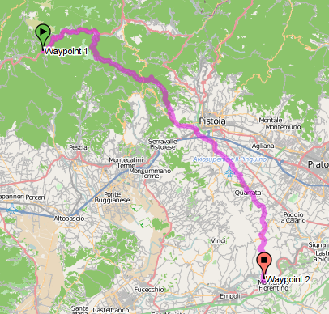

qgis-osrm
=========

QGIS OSRM python plugin


Introduction
------------

This page is about the develoment of a new QGIS Python plugin wich will retrieve data from an OSRM web service and display the result in QGIS.

OSRM stands for Open Source Routing machine (http://www.project-osrm.org), it is an amazing fast routing server for OSM data.


The new plugin will connect to a given, user defined, OSRM server and download routes, turn-by-turn instructions and reverse geoconding informations. Start, middle and end waypoints will be added by the user by clicking on the map canvas. 

 
The project is articulated in steps, the first step will deliver a working plugin with very basic functionalities. The following steps add more options until a full-fledged, configurable and API-expandable plugin will be built.

A fast routing machine as OSRM opens a lot of interesting possibilities, isochrones and catchment areas calculation is one of those. 


Use cases
---------

There are really many possible applications for a routing engine like OSRM, the basic use case is just find the fastest route between point A and B, the calculated route will contain the route geometries, cumulated and segment distances and travel times, turn-by-turn instructions with textual description of the turn (for example: "take the third exit at the roudabout"), the azimuth (angle) and the name of the streets at the waypoints junction.




Example of data returned from OSRM follows (JSON format):
```json

{
    "version": 0.3,
    "status": 0,
    "status_message": "Found route between points",
    "route_geometry": "galqHisis@gA}@pBsHuAaB}CgAyI_P@IKa@tDoG",
    "route_instructions": [
        [
            "10",
            "Marienstraße",
            45,
            0,
            2,
            "45m",
            "NE",
            319.32
        ],
        [
            "3",
            "Schulstraße",
            125,
            1,
            181,
            "125m",
            "E",
            251.9
        ],
        [
            "7",
            "Am Rahmtor",
            58,
            2,
            70,
            "58m",
            "NE",
            311.24
        ],
        [
            "1",
            "Marktplatz",
            90,
            3,
            109,
            "90m",
            "NE",
            315.05
        ],
        [
            "2",
            "Eppsteiner Straße",
            267,
            4,
            321,
            "267m",
            "NE",
            302.52
        ],
        [
            "11-2",
            "Feldbergstraße",
            137,
            7,
            3,
            "137m",
            "E",
            254.71
        ],
        [
            "15",
            "",
            0,
            8,
            0,
            "",
            "N",
            0
        ]
    ],
    "route_summary": {
        "total_distance": 740,
        "total_time": 86,
        "start_point": "Marienstraße",
        "end_point": "Feldbergstraße"
    },
    "via_points": [],
    "hint_data": {
        "checksum": -276364421,
        "locations": [
            "CSIsFYgPAAACAAAA____f7-KN3qj0KE_JJpMAEUVDQA",
            "GrSEAHsrAAATAAAAAQAAAFEhcqjIsu4_4JpMAAEYDQB"
        ]
    },
    "transactionId": "OSRM Routing Engine JSON Descriptor (v0.3)"
}

```

Another use case is reverse geocoding: find the nearest point on a street given a tuple of coordinates (step 3 here below).

Given the speed of OSRM, more complex use cases are also foreseeable, for example it would be possible to create ischrones, from Wikipedia:

    An isochrone map (isochrone plan, isochrone diagram) in science and urban planning is a map showing areas related to isochrones between different points. An isochrone is defined as "a line drawn on a map connecting points at which something occurs or arrives at the same time".

Instead of hard-coding complex procedures that would necessarily cover only a few use cases, the plugin (see step 5 here below) will be developed using an extensive API that will ease the creation of custom functions such the isochrone mentioned above.

Steps
-----

1. working prototype: this is the first development step, aimed to produce a working plugin that allows the user to download a route with start and end points, display the route in QGIS and save it into a memory layer. No options available.
2. Basic GUI: basic GUI to configure  and save the server URL and the line style, append/overwrite mode switch will also be available. 
3. Reverse Geocoding: implementation of OSRM geocoding with data saved into a memory layer
4. Full GUI: multiple OSRM server support, servers can be stored in the user preferencese, changed and retrieved, a default server can be set and changed in the options dialog. Full GUI support for all OSRM options (zoom etc.). Support for storage options other than a memory layer (SpatiaLite).
5. Python API: complete support for all OSRM options through a fully documented Python library, this step is the foundation to add more interesting functions to this plugin. Batch geocoding and routing available via API (not in the plugin GUI). The plugin code will be rewritten as needed to use the new API, to also serve as an example about using the API itself.


License
-------


The code will live on GitHub and will be released with GPL GNU General Public Licence

